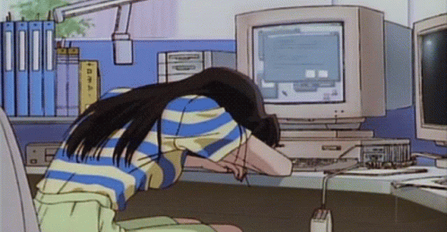

## 💫 About Me:

 

- 👻 Myself Ashesh Banerjee, people sometimes call me by Benediction

- 🫡 I am currently pursuing BCA from IEM Kolkata.

- 😌 Likes to eat, code and definitely like to sleep. 

- 🤝 Lets connect maybe we can build something together <3

- 📩 Gmail :- *Lbandopadhyay2@gmail.com*

 

## 🌐 Socials:

 

## 💻 Tech Stack:

 
 
 
 
 

 

## 📊 GitHub Stats:

|  |  |
| ------------- | ------------- |

 

## 📍 Pinned Repositories

 

