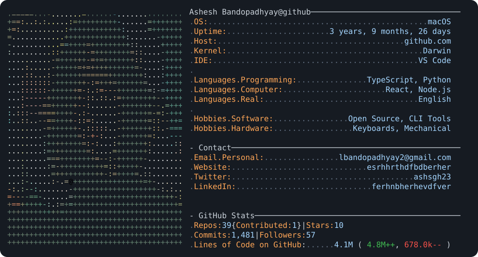

<a href="https://github.com/benedicti0n/benedicti0n">
  <picture>
    <source media="(prefers-color-scheme: dark)" srcset="dark_mode.svg">
    <source media="(prefers-color-scheme: light)" srcset="light_mode.svg">
    
  </picture>
</a>

<!-- GITHUBWALLPAPER:START -->
<picture>
  <source media="(prefers-color-scheme: dark)" srcset="https://githubwallpaper.com/api/card/2e1028yff14sgaeoejo8uy4o?theme=dark">
  <source media="(prefers-color-scheme: light)" srcset="https://githubwallpaper.com/api/card/2e1028yff14sgaeoejo8uy4o?theme=light">
  
</picture>
<!-- GITHUBWALLPAPER:END -->