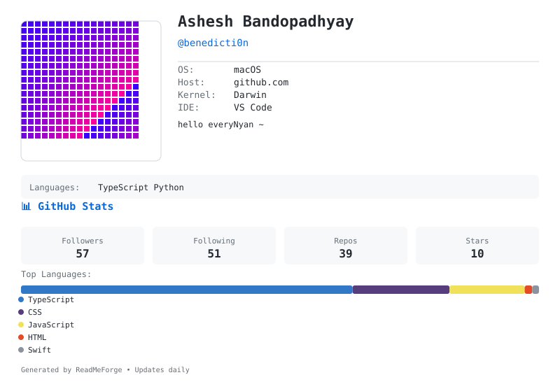

<picture>
  <source media="(prefers-color-scheme: dark)" srcset="assets/profile.svg">
  <source media="(prefers-color-scheme: light)" srcset="assets/profile.svg">
  
</picture>

---

<!--
  This README is dynamically generated by ReadMeForge.
  Do not edit directly — edit via the ReadMeForge builder.
-->

## Terminal Profile

```
   Ashesh Bandopadhyay
 OS:     macOS
 Host:   github.com
 Kernel: Darwin
 IDE:    VS Code
```

hello everyNyan ~

### 👨‍💻 Languages & Tools
**Programming:** `TypeScript`, `Python`
**Technologies:** `React`, `Node.js`
**Spoken:** English

### 🎮 Software Hobbies
- Open Source
- CLI Tools

### 🔧 Hardware Hobbies
- Keyboards
- Mechanical

### 📊 GitHub Stats
```
  📡 Followers: 57
  🛰️ Following: 51
  📦 Public repos: 39
  ⭐ Total stars: 10
  🔤 Top languages:
    • TypeScript (3.3MB)
    • CSS (950.8KB)
    • JavaScript (735.6KB)
    • HTML (74.4KB)
    • Swift (66.1KB)
```

### 📫 Contact
- Email: lbandopadhyay2@gmail.com
- Twitter: asheshtwt

---

*Generated by [ReadMeForge](https://github.com) — profile updates daily via GitHub Actions.*
